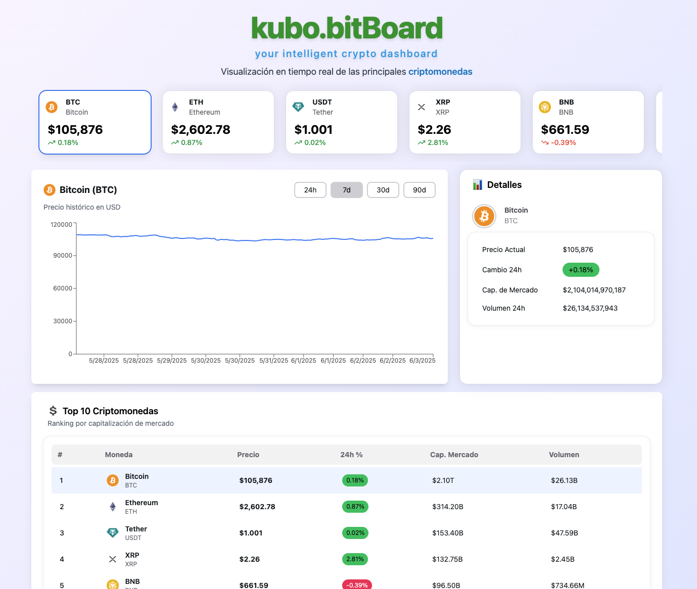

# React + TypeScript + Vite

This template provides a minimal setup to get React working in Vite with HMR and some ESLint rules.

Currently, two official plugins are available:

- [@vitejs/plugin-react](https://github.com/vitejs/vite-plugin-react/blob/main/packages/plugin-react) uses [Babel](https://babeljs.io/) for Fast Refresh
- [@vitejs/plugin-react-swc](https://github.com/vitejs/vite-plugin-react/blob/main/packages/plugin-react-swc) uses [SWC](https://swc.rs/) for Fast Refresh

## Expanding the ESLint configuration

If you are developing a production application, we recommend updating the configuration to enable type-aware lint rules:

```js# kubo.bitBoard 💹

**kubo.bitBoard** is a modern, responsive crypto dashboard built with React, Hero UI, Zustand, and React Query. It allows users to track the top cryptocurrencies in real-time with interactive charts, detailed info panels, and smooth UX loading states.



## ✨ Features

- 🔥 Top 10 crypto ranking with real market data (via CoinGecko API)
- 📈 Interactive price chart powered by Recharts
- 🧠 Global state management with Zustand
- 💾 Data fetching and caching with React Query
- 📱 Mobile-first responsive design
- 💀 Graceful error handling and Skeleton loading for better UX
- 🎨 Clean UI using Hero UI and Tailwind CSS

## 🚀 Technologies

- React + TypeScript
- Zustand (global state for selected coin)
- @tanstack/react-query (API caching and management)
- Hero UI (UI kit + skeleton loaders)
- Recharts (graph rendering)
- Tailwind CSS (utility-first styling)

## 📦 Installation

```bash
npm install
# or
yarn install
```

## 🧪 Development

clone .env.template and ajust with your apikey and rename to .env

```bash
npm run dev
# or
yarn dev
```

Then open [http://localhost:5173](http://localhost:5173)

## 🌍 API

Live data is fetched from [CoinGecko Market Chart API](https://www.coingecko.com/en/api/documentation).  
All requests include error handling and fallback mocks for testing.

## 📁 Project Structure

```plaintext
├── components/       # UI components (SliderCoins, Details, Ranking, CryptoChart)
├── interfaces/       # TypeScript interfaces
├── mocks/            # Mock data for dev/fallback
├── services/         # API calls (fetchTopCryptos, fetchCryptoHistory)
├── stores/           # Zustand state store
├── App.tsx           # Main layout and composition
```


## 🙌 Acknowledgements

- [CoinGecko](https://www.coingecko.com/) for public crypto data
- [Hero UI](https://www.heroui.dev/) for component library
- [Recharts](https://recharts.org/) for chart rendering

---

Built with 💚 and ☕ by  Israel Albarrán
export default tseslint.config({
  extends: [
    // Remove ...tseslint.configs.recommended and replace with this
    ...tseslint.configs.recommendedTypeChecked,
    // Alternatively, use this for stricter rules
    ...tseslint.configs.strictTypeChecked,
    // Optionally, add this for stylistic rules
    ...tseslint.configs.stylisticTypeChecked,
  ],
  languageOptions: {
    // other options...
    parserOptions: {
      project: ['./tsconfig.node.json', './tsconfig.app.json'],
      tsconfigRootDir: import.meta.dirname,
    },
  },
})
```

You can also install [eslint-plugin-react-x](https://github.com/Rel1cx/eslint-react/tree/main/packages/plugins/eslint-plugin-react-x) and [eslint-plugin-react-dom](https://github.com/Rel1cx/eslint-react/tree/main/packages/plugins/eslint-plugin-react-dom) for React-specific lint rules:

```js
// eslint.config.js
import reactX from 'eslint-plugin-react-x'
import reactDom from 'eslint-plugin-react-dom'

export default tseslint.config({
  plugins: {
    // Add the react-x and react-dom plugins
    'react-x': reactX,
    'react-dom': reactDom,
  },
  rules: {
    // other rules...
    // Enable its recommended typescript rules
    ...reactX.configs['recommended-typescript'].rules,
    ...reactDom.configs.recommended.rules,
  },
})
```
